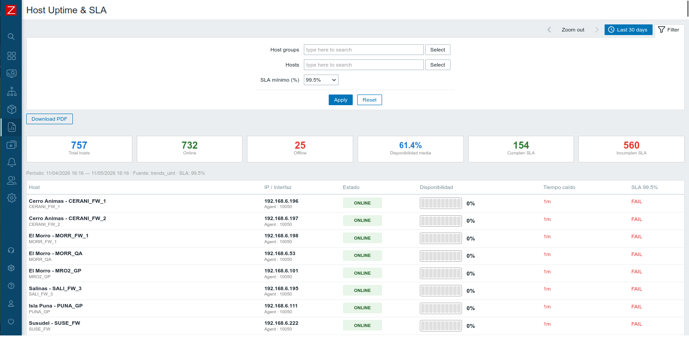
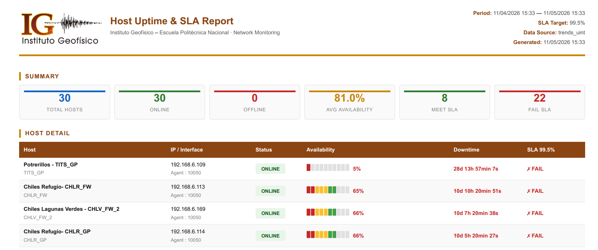

<p align="right"><a href="README.md">English</a></p>

# <p align="center">Host Uptime & SLA – Módulo para Zabbix 7</p>

<p align="center">
    <a href="https://www.zabbix.com/"></a>
    <a href="https://www.php.net/"></a>
    <a href="https://github.com/rotoapanta/host-uptime-sla-module/issues"></a>
    <a href="https://github.com/rotoapanta/host-uptime-sla-module"></a>
    <a href="https://github.com/rotoapanta/host-uptime-sla-module/commits"></a>
    <a href="https://www.linux.org/"></a>
    <a href="https://opensource.org/licenses/MIT"></a>
    <a href="https://www.linkedin.com/in/roberto-carlos-toapanta-g/"></a>
    <a href="#-changelog"></a>
    <a href="https://github.com/rotoapanta/host-uptime-sla-module/fork"></a>
</p>

Módulo personalizado para Zabbix 7 que genera un reporte detallado de disponibilidad y cumplimiento de SLA para todos los hosts monitoreados. Consulta datos del ítem `icmpping` desde `history_uint` o `trends_uint`, calcula el porcentaje de uptime y tiempo caído por host, y compara los resultados contra un objetivo de SLA configurable.

---

## ✨ Características

- **UI nativa de Zabbix 7:** Usa el selector de tiempo nativo (calendario, rangos rápidos, zoom out) y los componentes de filtro de Zabbix.
- **Filtrado flexible:** Filtrar por grupos de hosts, hosts específicos y porcentaje objetivo de SLA.
- **Barra de disponibilidad visual:** Barra con escala de colores (rojo / amarillo / verde) y porcentaje por host.
- **Badges de estado:** Badge Online / Offline / Mantenimiento por host.
- **Formato de tiempo caído:** Downtime expresado en años, meses, días, horas y minutos.
- **Estadísticas globales:** Tarjetas de total de hosts, online, offline, disponibilidad media, cumplen/incumplen SLA.
- **Exportación PDF:** Reporte PDF con identidad corporativa IG-EPN, auto-impresión al cargar.
- **Menú integrado:** Aparece en **Reports → Host Uptime & SLA** dentro de Zabbix.
- **Modo debug:** Configurable mediante el flag `$show_debug` en la vista.
- **Verificador de despliegue:** Script `deploy_check.sh` que valida integridad de archivos vía MD5 + tamaño.
- **Manejo de errores:** try/catch en todas las queries a BD — los errores se muestran como avisos visuales en lugar de romper la página.
- **Hosts sin icmpping:** Los hosts sin el ítem `icmpping` se incluyen en la tabla como "Sin datos" con un aviso azul.
- **Caché APCu:** Resultados en caché durante 5 minutos vía APCu (si está disponible) — la clave se invalida automáticamente al cambiar los filtros.

---

## 🛠️ Requisitos del sistema

| Componente | Versión |
|------------|---------|
| Zabbix     | 7.0.x   |
| PHP        | 8.1+    |
| Hosts      | Ítem `icmpping` habilitado y monitoreado |

---

## 🗂️ Estructura del proyecto

```
host-uptime-sla-module/
├── actions/
│   ├── HostUptimeSlaModule.php       # Controlador principal
│   └── HostUptimeSlaModulePdf.php    # Controlador PDF
├── assets/
│   ├── igepn_logo.png                # Logo corporativo (encabezado PDF)
│   └── screenshots/
│       ├── screenshot_main.png
│       └── screenshot_pdf.png
├── views/
│   ├── host.uptime.sla.module.php    # Vista principal
│   └── host.uptime.sla.pdf.php       # Vista PDF (layout.print)
├── deploy_check.sh                   # Verificador de despliegue (MD5 + tamaño)
├── manifest.json                     # Manifiesto del módulo
├── Module.php                        # Registro en el menú
├── README.md
└── README.es.md
```

---

## 🚀 Instalación

### 1. Copiar el módulo al servidor

```bash
# Crear directorio en el servidor
sudo mkdir -p /var/www/html/zabbix/modules/host-uptime-sla-module
sudo chown -R rtoapanta:www-data /var/www/html/zabbix/modules/host-uptime-sla-module
sudo chmod -R 775 /var/www/html/zabbix/modules/host-uptime-sla-module

# Desplegar desde la máquina local
rsync -avz --progress \
  ~/ruta/al/host-uptime-sla-module/ \
  usuario@servidor:/var/www/html/zabbix/modules/host-uptime-sla-module/
```

### 2. Habilitar en Zabbix

Ir a **Administration → Modules**, hacer clic en **Scan directory** y luego habilitar `host-uptime-sla-module`.

El módulo aparecerá en **Reports → Host Uptime & SLA**.

---

## ✅ Verificación del despliegue

```bash
chmod +x deploy_check.sh
./deploy_check.sh
```

Salida esperada:

```
╔══════════════════════════════════════════════════════════╗
║   Host Uptime & SLA Module – Deploy Verifier             ║
╚══════════════════════════════════════════════════════════╝

actions/HostUptimeSlaModule.php       [OK]  md5=abc123…  size=11200B
actions/HostUptimeSlaModulePdf.php    [OK]  md5=def456…  size=9800B
views/host.uptime.sla.module.php      [OK]  md5=ghi789…  size=14100B
views/host.uptime.sla.pdf.php         [OK]  md5=jkl012…  size=12300B
Module.php                            [OK]  md5=mno345…  size=1100B
manifest.json                         [OK]  md5=pqr678…  size=434B

✔  Todos los archivos coinciden. Deploy OK.
```

---

## 📖 Uso

### Filtros disponibles

| Filtro          | Descripción                                         |
|-----------------|-----------------------------------------------------|
| Host groups     | Filtrar hosts por uno o más grupos                  |
| Hosts           | Filtrar por hosts específicos                       |
| SLA mínimo      | Objetivo: 99.9 / 99.5 / 99.0 / 98.0 / 95.0 %      |
| From / To       | Rango de tiempo con el selector nativo de Zabbix    |

### Lógica de fuente de datos

| Período       | Fuente         |
|---------------|----------------|
| ≥ 1 día       | `trends_uint`  |
| < 1 día       | `history_uint` |

### Modo debug

En `views/host.uptime.sla.module.php`:

```php
$show_debug = true;   // muestra la barra de debug (parámetros + timestamps)
$show_debug = false;  // modo producción (por defecto)
```

### Avisos del sistema

Los avisos aparecen automáticamente entre el botón Download PDF y las tarjetas de estadísticas cuando se detecta alguna condición:

| Aviso | Color | Condición |
|-------|-------|-----------|
| ⚠ Error de base de datos | 🔴 Rojo | Fallo en query a BD — muestra el mensaje de error |
| ℹ Hosts sin icmpping | 🔵 Azul | Uno o más hosts no tienen el ítem `icmpping` |
| ⚡ Caché activo | 🟣 Violeta | Resultados servidos desde caché APCu (TTL 5 min) |

Si no aparece ninguno, todo está funcionando correctamente.

---

## 📄 Exportación PDF

Al hacer clic en **Download PDF** se abre el reporte en una nueva pestaña con:

- Logo IG-EPN y colores corporativos (`#8B4513`, `#C8860A`)
- Período, objetivo SLA, fuente de datos y fecha de generación
- Tarjetas de estadísticas del resumen
- Tabla completa con barras de disponibilidad y resultado SLA
- Diálogo de impresión automático al cargar la página
- Nombre de archivo sugerido: `Host_Uptime_SLA_YYYY-MM-DD_HH-mm.pdf`

---

## 📸 Capturas de pantalla

### Vista principal


### Exportación PDF


---

## 💬 Feedback

Para comentarios o sugerencias: robertocarlos.toapanta@gmail.com

## 🛟 Soporte

Para soporte, escribir a robertocarlos.toapanta@gmail.com

## 📄 Licencia

[MIT](https://opensource.org/licenses/MIT)

## 👥 Autores

- [@rotoapanta](https://github.com/rotoapanta)

---

## 📜 Changelog

Este proyecto sigue [Keep a Changelog](https://keepachangelog.com/) y [Semantic Versioning](https://semver.org/).

### [Unreleased]
-

### 1.1.0 – 2026-05-11
- Manejo de errores con try/catch en todas las queries a BD.
- Avisos visuales para errores de BD, hosts sin `icmpping` y estado de caché APCu.
- Los hosts sin ítem `icmpping` ahora aparecen en la tabla como "Sin datos" en lugar de ser omitidos silenciosamente.
- Soporte de caché APCu (TTL 5 min) con invalidación automática de clave al cambiar filtros.
- Versión actualizada a 1.1.0 en los docblocks de todos los controllers.

### 1.0.0 – 2026-05-11
- Versión estable inicial.
- Selector de tiempo nativo de Zabbix 7 (calendario + rangos rápidos).
- Filtro por grupos de hosts, hosts y objetivo de SLA.
- Exportación PDF con identidad corporativa IG-EPN.
- Script de verificación de despliegue (`deploy_check.sh`).
- Flag de modo debug (`$show_debug`).

---

## 🔗 Links

[](https://www.linkedin.com/in/roberto-carlos-toapanta-g/)

[](https://twitter.com/rotoapanta)
